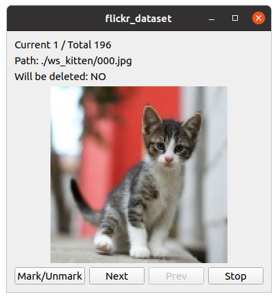

**[WARNING]**

- This repository is now archived.
- Please check the Kotlin implementation, [FlickrDataset](https://github.com/rubycho/FlickrDataset/).

## flickr-dataset-cpp

**Simple** program for downloading massive images from flickr.

This is a C++ Implementation of [flickr-dataset](https://github.com/rubycho/flickr-dataset).

### Build requirements

- cmake
- curl (libcurl-dev in ubuntu)
- Qt 5+ (qt5-default in ubuntu)
- OpenCV 3.4+

### Functions

- Download images by keyword from flickr (command: `download`).
- View individual images, select images to delete (command: `check`).

### How to use

#### Download

Download the program in release.

#### Configuration File

Copy `config.example.ini` file as `config.ini` and edit it.

**Caution**:
- The size should be bigger than or equal to 128, smaller than or equal to 640.

#### Download images massively

```
./flickr_dataset download
```

approx. (END_PAGE - START_PAGE + 1) * 100 images will be downloaded.

#### Check images one by one

```
./flickr_dataset check
```

The Qt window will show up,
and images located in `ws_{KEYWORD}` will be shown on the window one by one.

There are four buttons available.



- Mark/Unmark: Mark or Unmark image.
- Next: Show next image.
- Prev: Show previous image.
- Stop: Stop, and remove all marked images.
